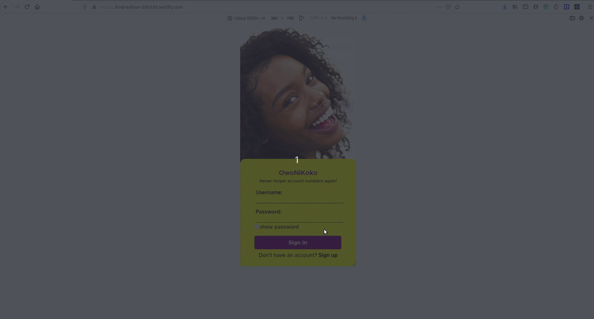

# OwoNiKoko

In Nigeria, people generally have a number of bank accounts. Remembering all those bank accounts especially for different people can be a battle. Here's a simple app that lets you keep everyone's bank accounts in one place so you can simply go to the app and copy and paste anytime you want to make a transfer or send one of your many account numbers to someone else. This app is designed for mobile view.




The app includes a Rails API that renders JSON to be consumed
by React Views.

## Built With

- Rails
- React Hooks
- Context API
- Axios
- FontAwesomeIcons
- JWT
- React skeleton

## Live Demo

[Live Demo Link](https://kind-edison-586550.netlify.com/)

## Front-end Repo

[Front end git repo](https://github.com/onedebos/owonikoko)

## Getting Started

**To get started, follow the instructions below**

To get a local copy up and running follow these simple example steps.

- git clone the frontend repo

```
git clone https://github.com/onedebos/owonikoko
```

- git clone the backend repo if you want to run the server on your local machine. Otherwise, skip the next 3 steps.

```
git clone https://github.com/onedebos/owonikoko-api
```

- cd into the backend repo and install the gems

```
bundle install
```

- run the rails server on port 3001

```
rails s -p 3001
```

- If you decide to run the server locally, cd into the frontend repo. Navigate to src/components/helper/apiUrl.js and change the API_URL string to

```
http://localhost:3001
```

- run

```
npm install
```

to install all packages. then

```
npm start
```

- to start the app in the browser.

### Prerequisites

- Make sure to have Rails 6.0 and Ruby 2.5.1

### Install

Install the Ruby Gems required by rails

```
bundle install
```

### Deployment

## Authors

👤 **Adebola**

- Github: [@githubhandle](https://github.com/onedebos)
- Twitter: [@twitterhandle](https://twitter.com/debosthefirst)
- Linkedin: [linkedin](https://www.linkedin.com/in/adebola-niran/)

## 🤝 Contributing

Contributions, issues and feature requests are welcome!

Feel free to check the [issues page](issues/).

## Show your support

Give a ⭐️ if you like this project!

## Acknowledgments

## 📝 License

This project is [MIT](lic.url) licensed.
